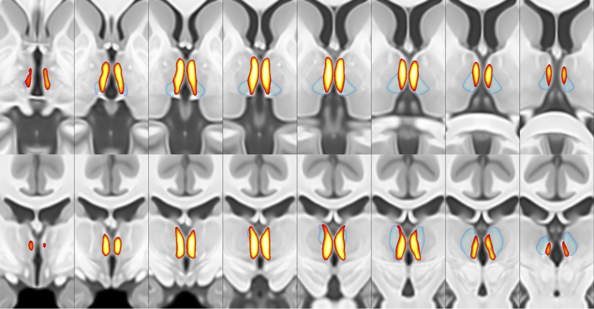

# PVT Probability Atlas

This repository contains the Probability Atlas of the **Paraventricular nucleus of the thalamus (PVT)**, created as part of our study titled "A structural connectivity-based segmentation approach to identify the human paraventricular nucleus of the thalamus." This atlas was developed based on structural connectivity patterns identified using diffusion MRI data and is intended for use in neuroimaging research, especially for studies focusing on mood regulation and addiction-related behaviors.


## Overview

The PVT is a crucial component of the limbic system, involved in mood and addiction-related processes. This atlas provides a probabilistic map of the PVT in standard MNI space, enabling other researchers to explore its structural and functional connectivity.



### Key Features
- **Connectivity-Based Segmentation**: The PVT was identified using a k-means clustering approach based on structural connectivity patterns within the magnocellular subdivision of the mediodorsal thalamus.
- **Validation**: The atlas was validated on two large cohorts, showing consistent PVT-specific connectivity patterns with the nucleus accumbens, amygdala, and bed nucleus of the stria terminalis (BNST).


## Citation

If you use our probability atlas, we ask you to kindly cite the following papers:

**In Preparation...**

## Files

- `Right{Left}_PVT_MNI.nii.gz`: The probabilistic atlas of the right and left PVT in the MNI template space.
- `LICENSE`: The license information for this repository.
- `README.md`: This file, providing an overview of the atlas and instructions for use.

## Usage

1. **Download the Atlas**: Clone this repository or download the `PVT_lh_MNI.nii.gz` or `PVT_rh_MNI.nii.gz` files in `Atlas` directly.
2. **Load the Atlas**: The atlas can be loaded in most neuroimaging software (e.g., FSL, SPM, FreeSurfer).
3. **Analysis**: Use the atlas to extract structural and functional connectivity data for the PVT or to study its associations with psychiatric and addiction-related variables.

## Example Code

Here is an example code snippet in Python for loading the atlas using nibabel:

```python
import nibabel as nib

# Load the PVT Probability Atlas
pvt_atlas_lh = nib.load("Left_PVT_MNI.nii.gz")
pvt_atlas_rh = nib.load("Right_PVT_MNI.nii.gz")

# Display atlas dimensions
print(pvt_atlas_lh.shape)
print(pvt_atlas_rh.shape)
